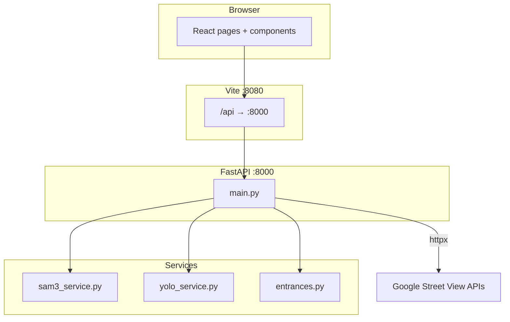

# CV-Scan-Satellite — GeoAI Suite

One **monorepo** with three browser apps, one **React** frontend (Vite), and one **FastAPI** backend. After reading this document you should know **what each part does**, **how data flows**, **where to change behavior**, and **how to run and debug** the system.

The project sits at the intersection of **computer vision**, **web mapping**, and **public transit data**. CV-Scan is aimed at people who want to **probe** what a model sees in a given street photograph or satellite crop, then optionally **export** coarse building locations into GIS-friendly formats. Venue Finder answers a different question: **where recorded transit entrances already are**, using curated tables derived from GTFS-style sources so analysts can relate “model guesses” to “published entrance coordinates” on the same mental map. The Spatial Visualizer rounds out the suite by showing that **heavy analytics do not always require a server-side database**: DuckDB compiled to WebAssembly can ingest GeoJSON, run SQL including spatial extensions when available, and drive a map—all without leaving the browser.

This README mixes **tables and lists** (for quick lookup) with **paragraphs** (for context). If you are onboarding, read the [Narrative overview](#narrative-overview) and [Big picture](#big-picture) first; if you are debugging a specific endpoint, jump to [Backend API](#backend-api-complete-reference) or the engine sections.

---

## Table of contents

1. [Narrative overview](#narrative-overview)
2. [Big picture](#big-picture)
3. [How to run](#how-to-run)
4. [App 1: CV-Scan (`/`)](#app-1-cv-scan-)
5. [App 2: Venue Finder (`/venues`)](#app-2-venue-finder-venues)
6. [App 3: Spatial Visualizer (`/spatial`)](#app-3-spatial-visualizer-spatial)
7. [Backend API (complete reference)](#backend-api-complete-reference)
8. [Detection engines (SAM 3 and YOLO)](#detection-engines-sam-3-and-yolo)
9. [Transit entrances (`entrances.py` + data)](#transit-entrances-entrancespy--data)
10. [Frontend architecture (files and responsibilities)](#frontend-architecture-files-and-responsibilities)
11. [Configuration and environment variables](#configuration-and-environment-variables)
12. [Performance and hardware](#performance-and-hardware)
13. [Repository layout](#repository-layout)
14. [Troubleshooting](#troubleshooting)
15. [Limitations, security, and scope](#limitations-security-and-scope)
16. [Where to look first (contributors)](#where-to-look-first-contributors)

---

## Narrative overview

The suite was assembled by **merging** several ideas into a single developer experience rather than publishing three separate repositories. That choice has practical consequences you will feel when you run the app: one `npm run dev` brings up the React shell and the shared Suite navigation, while `npm run backend` starts the single Python process that powers **both** vision inference and **optional** transit search APIs. The frontend never hard-codes `http://localhost:8000`; it always speaks to **`/api`**, which Vite forwards to the backend. That indirection matters because in production you might terminate TLS on a gateway, run the API on another host, or inject a staging URL through **`VITE_API_URL`** without rewriting component code.

CV-Scan’s **split layout** is intentional. The left pane is the **geographic workspace**—where the user establishes “where on Earth we are talking about” through a pin, search, or map extent. The right pane is the **image workspace**—where pixels are analyzed and overlays are drawn. When you capture the map with html2canvas or fetch Street View through the backend, you are **bridging** those two worlds: the image becomes the unit of inference, while map bounds (when recorded) become the bridge back to latitude and longitude for exports. That bridge is only as honest as the user’s setup; for an uploaded screenshot, the README and the UI both stress that **aligning the live map with the image** before exporting WGS84 is the user’s responsibility, because the software cannot know the crop’s geographic footprint unless it came from a known capture path.

The **two detection engines** embody different engineering tradeoffs. SAM 3 is a **foundation model** gated on Hugging Face: it understands **open-vocabulary text prompts** and returns **instance masks**, which the backend turns into polygons. That richness comes with **latency**, **GPU memory**, and **operational** requirements (tokens, access approval). The bundled YOLO path is a **specialized detector** trained on doors, exposed through Ultralytics with a **fixed** weight file. It is typically **faster** and **lighter** to deploy but speaks in **boxes**, not free-form masks, and its quality depends entirely on how well the training data matches your imagery. The JSON contract is deliberately **shared** so the React overlay can treat both engines uniformly, swapping only the `engine` field and the presence or simplicity of polygons.

Venue Finder and the **`entrances.py`** service illustrate **duplicate but complementary** data paths. The Venue page **mostly** loads CSV from the static **`public`** tree so demos work even against a **static file host** with no Python. The FastAPI routes under **`/entrances`** read sibling files under **`backend/data/entrances`** and add **fuzzy search** and **bounding-box filtering**, which is what you would use for autocomplete, mobile clients, or server-driven queries. Keeping both copies in sync is a maintenance burden; the README calls that out so you do not assume a single source of truth on disk.

Finally, the Spatial Visualizer exists because **analysts often need SQL**, not just a map. Shipping DuckDB in WASM avoids provisioning Postgres or Spatialite for workshops and prototypes. It is deliberately **isolated** in vanilla JS and a second HTML entry so it does not inflate the React bundle or force every visitor to download the WASM binary. The iframe in **`SpatialSqlPage`** is a thin integration layer that still gives a unified **GeoAI Suite** brand in the nav.

---

## Big picture

### Three apps, one dev server

| Route | Application | What users do |
|-------|-------------|----------------|
| **`/`** | **CV-Scan** | Pick a place on a map → get **Street View** or **map/satellite** imagery → run **SAM 3** or **YOLO** → see **polygons/boxes**; satellite mode can **export** building points as **GeoJSON** |
| **`/venues`** | **Venue Finder** | Choose a **city** → see **transit entrances** on a map; data comes from **static CSV** files (and optional extra layers, e.g. Metra on Chicago) |
| **`/spatial`** | **Spatial Visualizer** | **DuckDB in the browser (WASM)** → upload **GeoJSON** → run **SQL** → see **table + map** |

Switch apps with the **Suite** nav (`frontend/src/components/SuiteNav.tsx`).

### Ports and proxying

- **Frontend:** Vite serves **`http://localhost:8080`** (`frontend/vite.config.ts`).
- **Backend:** Uvicorn runs **`http://localhost:8000`** (`npm run backend` → `backend/main.py`).
- Browser calls **`/api/...`**. Vite **rewrites** `/api` to the backend root (same path without `/api`). Example: `fetch("/api/detect?...")` → `http://localhost:8000/detect?...`.

Optional override: set **`VITE_API_URL`** to a full origin if the UI should talk to a remote API.

### System diagram



From a networking standpoint, the browser only ever talks to **one origin during development** (the Vite server). That avoids mixed-content issues and simplifies cookies or future auth: the API is same-origin relative to the page. CORS is still configured on FastAPI for the listed localhost ports because some tooling or future splits (e.g. opening the UI from `5173` while the API stays on `8000`) might bypass the proxy. If you add new dev hostnames, update **`CORSMiddleware`** in `main.py` alongside **`vite.config.ts`**.

---

## How to run

### Prerequisites

- **Node.js** 18+
- **Python** 3.10+
- **Hugging Face** account, access to **[facebook/sam3](https://huggingface.co/facebook/sam3)**, and a **[token](https://huggingface.co/settings/tokens)**

### Install

```bash
cd frontend && npm install && cd ..
cd backend && python -m venv venv && source venv/bin/activate  # Windows: venv\Scripts\activate
pip install -r requirements.txt && cd ..
```

### YOLO weights (optional, for `engine=yolo`)

The backend loads a **self-trained YOLOv9-Tiny door** model (`backend/yolo_service.py`). Put weights at:

1. **`backend/yolo-selftrain/yolov9t.pt`**, or  
2. **`backend/yolov9t.pt`**, or  
3. Any path via **`YOLO_WEIGHTS=/path/to/model.pt`**

Weights are **not** downloaded automatically.

### Two terminals (from **repository root**)

**Terminal 1 — backend**

```bash
export HF_TOKEN=your_huggingface_token_here
npm run backend
```

`npm run backend` (see `frontend/package.json`) frees port 8000 if needed, then runs `venv/bin/python -m uvicorn main:app --reload --port 8000` from **`backend/`**.

**Terminal 2 — frontend**

```bash
npm run dev
```

Open **http://localhost:8080**.

### Root npm scripts

| Script | Effect |
|--------|--------|
| `npm run dev` | Vite dev server (`frontend/`) |
| `npm run backend` | FastAPI on **:8000** |
| `npm run build` | Production build |
| `npm run lint` | ESLint |
| `npm test` | Vitest |

In day-to-day development you almost always want **both** processes running. The frontend can render without the backend, but CV-Scan will either show **mock** detections (SAM path only) or hard-fail on YOLO until weights and the server exist. Venue Finder’s map will still paint **static** CSV markers without Python; only **live** fuzzy search and the Street View thumbnail pipeline require FastAPI. If you change Python dependencies, recreate or upgrade the venv; if you change only TypeScript, Vite’s HMR will hot-reload without restarting the API.

---

## App 1: CV-Scan (`/`)

**Page:** `frontend/src/pages/Index.tsx`

### Purpose

Support **exploratory** workflows: “does this street frame or satellite crop contain **entrance-like** or **building-like** regions?” Outputs are **assistive**, not a certified survey.

The page is built around **state** that must stay consistent: `detectionMode` and `detectionEngine` choose which query string the client sends; `imageUrl` and `detectionResult` drive the preview and overlay; `buildingMapMarkers` is derived **only** when satellite inference completes **and** the scan captured valid map bounds. A new run clears markers first so stale dots are not left on the map. Error messages are deliberately short in the UI but the console retains stack traces—when users report “nothing happened,” check both **network** (did `/api/detect` return 4xx/5xx?) and **logs** (did SAM fail to load at startup?).

### User-visible flow

1. **Map (left):** Leaflet map with **OSM**, optional **satellite** tiles, and **Street View** mode (`frontend/src/components/MapPanel.tsx`).
2. **Geocoding:** Search uses **Nominatim** (no API key).
3. **Pin:** Click map or search → `selectedPin` updates.
4. **Inference mode (right):** Toggle **Entrances** (`streetview`) vs **Buildings** (`satellite`) — sets `detectionMode` sent as `mode=` to the API.
5. **Engine:** **SAM 3** vs **YOLO** — sets `engine=` on `POST /detect`.
6. **Image source:**
   - **Scan Map:** If Street View is active → `GET /api/streetview-image?lat=&lng=&heading=` → JPEG `File` → detect. Else **html2canvas** on the map container → PNG `File` → detect; in **satellite** scan, **visible map bounds** are stored for **geo export**.
   - **Upload / paste:** `ImageUpload` or global **paste** listener (Cmd/Ctrl+V). Paste **infers** `streetview` vs `satellite` from the current map view when possible.
7. **Results:** `SatelliteViewer` + `DetectionOverlay` (SVG aligned to image). Satellite + successful scan can show **building centroid markers** on the map (`buildingMapMarkers`).
8. **Export:** Buttons call `buildBuildingsGeoJSON` / `buildBuildingsGeoJSONPixels` and `downloadJsonFile` (`frontend/src/lib/exportBuildingPoints.ts`). **WGS84** export from an **uploaded** image uses **current left-map bounds** — user must **align** the map with the image or coordinates are wrong (see in-app messaging in `Index.tsx`).

### MapPanel internals (important details)

- **Views:** `"map"` | `"satellite"` | `"streetview"` (`MapPanel` state `activeView`).
- **Imperative API** (`MapPanelHandle`): `getContainerEl`, `isStreetView`, `isSatelliteView`, `getPin`, `getHeading` (currently returns `0` — heading for Street View fetch uses pin + backend geometry), `getVisibleMapBounds` → `{ west, east, north, south }` for correlating pixels to lat/lng.
- **Ann Arbor boundary:** Optional outline from `frontend/public/ann_arbor_city_boundary.csv` (CSV `lat,lon` segments).

### html2canvas capture quality

`Index.tsx` uses `scale: Math.min(3, Math.max(2, window.devicePixelRatio || 2))` so captures are not ~200px wide (which hurts both SAM and YOLO).

### Fallback when the backend fails

- **`runBackendDetection`** (`frontend/src/lib/backendDetection.ts`) — `POST /api/detect`, **8-minute** timeout.
- If the request fails and **engine is SAM 3**, **`runMockDetection`** runs (`frontend/src/lib/mockDetection.ts`) with fake labels and `mock: true`.
- If **engine is YOLO** and the backend errors, **no mock** — user sees the error (typically missing weights).

### Dead / unused client paths (still in repo)

- **`frontend/src/lib/entranceDetection.ts`** — TensorFlow.js COCO-SSD; **not** imported by `Index.tsx`.
- **`frontend/src/lib/cta-data.ts`** — static CTA loader; **not** used by `VenuesPage` (which uses `loadTransitData`).

---

## App 2: Venue Finder (`/venues`)

**Page:** `frontend/src/pages/VenuesPage.tsx`

### Data model

- **`frontend/src/data/venues.ts`** exports **`MOCK_VENUES`**: each venue has `coordinates`, optional **`dataFile`** (e.g. `cta.txt`), **`sourceLabel`**, **`markerColor`**, **`zoom`**, optional **`extraDataFiles`** (e.g. Chicago loads **Metra** as a second color layer).
- **`EntranceMarker`** entries include **decorative** `x,y` percentages for the card UI plus real **`lat`/`lng`**.

### Loading transit CSV

- **`loadTransitData(filename, sourceLabel)`** in `frontend/src/lib/transit-data.ts` fetches **`/data/entrances/<filename>`** (files live under **`frontend/public/data/entrances/`**).
- Parser supports a normal header row or an optional **leading index column** (see `parseCSVLine` and header detection).
- **Current CSV set:** `bart.txt`, `cta.txt`, `lametro.txt`, `mbta.txt`, `metra.txt`, `mta.txt`, `parismetro.txt`, `sfmta.txt`, `tfl.txt`, `wmata.txt`.

### Backend search API (optional integration)

- **`frontend/src/lib/entrances-api.ts`** defines **`searchTransitEntrances`** → `GET /api/entrances` and **`fetchCtaEntrances`** → `GET /api/entrances/cta`.
- The **Venue Finder page does not call these** in the current tree; they are ready for search boxes, mobile apps, or future UI.

The **MOCK_VENUES** list mixes two kinds of information. Fields like **`dataFile`** and **`extraDataFiles`** drive **dynamic** loading of thousands of real entrance rows from disk. The **`entrances`** arrays embedded in each city are **hand-placed** highlights for the card UI and do not automatically sync with the CSV; treat them as **curated examples** for demos. When you add a new city, you typically add a matching **`.txt`** under `public/data/entrances/`, wire it in **`venues.ts`**, and optionally add a row to **`backend/data/entrances/bounding.txt`** if you want the search API to index that region.

---

## App 3: Spatial Visualizer (`/spatial`)

**Page:** `frontend/src/pages/SpatialSqlPage.tsx` — a full-viewport **iframe** loading **`/spatial-sql.html`**.

**Implementation:** `frontend/src/spatial-sql/` (vanilla JS + CSS):

- **`duckdb.js`** — `@duckdb/duckdb-wasm`: `initDuckDB`, `runQuery`, `arrowToObjects`; tries `INSTALL spatial; LOAD spatial;` (may warn if unavailable).
- **`main.js`** — Wires CodeMirror SQL editor, run/clear, example queries, file input + **drag/drop**, **`MAX_FILES_PER_UPLOAD = 3`** GeoJSON/JSON files per batch.
- **`map.js`**, **`editor.js`**, **`results.js`**, **`upload.js`**, **`examples.js`** — MapLibre map, results table, GeoJSON ingestion, canned SQL.

**Build:** `vite.config.ts` **`rollupOptions.input`** includes both **`index.html`** and **`spatial-sql.html`**.

Because the spatial tool is **not** a React component tree, it does not use the same `@/` imports or Tailwind pipeline as the rest of the suite unless you deliberately unify them. That separation keeps cold-load time lower for users who only open CV-Scan. The iframe border is removed in **`SpatialSqlPage`** so the inner app feels embedded; if you need deep linking or shared auth between React and DuckDB in the future, you would replace the iframe with a more integrated mount or postMessage bridge.

---

## Backend API (complete reference)

**Module:** `backend/main.py`

FastAPI was chosen for **automatic OpenAPI docs** (`/docs`), **type-annotated** query parameters, and **async** HTTP client usage for Street View fetches. The application is intentionally **small**: there is no separate router package; all routes live in one module so a newcomer can scroll through the entire surface area in a few screens. Errors are mapped to **HTTPException** with messages the frontend sometimes surfaces raw—when improving UX, prefer catching known cases in **`Index.tsx`** and leaving 500s for truly unexpected failures.

The **`/streetview-image`** route is more than a thin proxy: it **interprets** Google’s metadata JSON, extracts **`pano_id`**, and **recomputes yaw** so the thumbnail faces the user’s dropped pin rather than an arbitrary default heading. That logic is why the client passes **`lat`/`lng`** even when the user never adjusts heading manually. Thumbnails are fixed at **640×640**, which matches common Street View tile sizes and keeps payload size predictable for SAM and YOLO.

| Method | Path | Role |
|--------|------|------|
| `GET` | `/health` | `{"status":"ok"}` — no ML load |
| `GET` | `/streetview-image?lat=&lng=&heading=` | Street View **metadata** → resolve `pano_id` → **640×640** JPEG thumbnail facing the pin |
| `GET` | `/entrances?query=&lat_min=&lat_max=&lon_min=&lon_max=` | Fuzzy station search over backend CSV index |
| `GET` | `/entrances/cta?...` | CTA-only list, bbox optional |
| `POST` | `/detect?mode=streetview\|satellite&engine=sam3\|yolo` | Multipart **file** (image) → detection JSON |

**`POST /detect`**

- **Body:** `multipart/form-data` with field **`file`** (jpeg/png/webp).
- **`mode`:** `streetview` | `satellite`
- **`engine`:** `sam3` | `yolo` | `yolov9` | `yolo26` (the last two are **aliases** → `yolo`)

**CORS:** `localhost` / `127.0.0.1` on **5173** and **8080**.

**Startup:** `load_sam3()` runs once; **failure is logged** — server still starts; SAM routes error when called.

---

## Detection engines (SAM 3 and YOLO)

Both engines receive the **same** raw bytes the browser uploaded. Neither engine “knows” whether the image came from Street View, a phone screenshot, or a satellite scrape—only the **`mode`** hint steers prompts (street vs building) and post-processing. That means **domain shift** is real: a model tuned on Google’s panoramas may behave differently on drone imagery. The SAM pipeline compensates with a **long** chain of filters tuned on typical failure modes (reflective glass, pedestrians, map UI chrome when it leaks into crops). The YOLO pipeline compensates with **geometric** rules suited to upright doors in perspective, then caps the count of returned boxes so the UI is not flooded.

### SAM 3 (`backend/sam3_service.py`)

- **Model:** `facebook/sam3` via **Transformers** (`Sam3Model`, `Sam3Processor`).
- **Street text prompts:** `"door"`, `"building entrance"` (`STREETVIEW_PROMPTS`). Optional **vehicle** pass: `"car"`, `"vehicle"` if **`SAM3_VEHICLE_PASS=1`** (helps **filter** entrances on vehicles; vehicle labels are **stripped** before the API response).
- **Satellite text prompts:** `"building"`, `"roof"` → merged to label **`building`**.
- **Default resize:** Street **`SAM3_STREET_MAX_DIM`** default **384** (comment: CPU latency target). Satellite **`SAM3_SAT_MAX_DIM`** default **640** (clamped in `_run_detection_inner`).
- **Dtype:** **float16** on **CUDA** only; **float32** on **MPS/CPU** (MPS float16 avoided due to decoder issues).
- **Device:** **`SAM3_DEVICE`**: `cpu` (default), `cuda`, `mps`, `auto`.
- **Inference:** Batched prompts (`_BATCH_SIZE = 2`), masks → contours → polygons (**OpenCV**), bboxes aligned to full image after resize.
- **Post-processing (street, high level):** NMS, overlap/person/sign/vehicle/clutter filters, merge entrance fragments, **façade / ground-band** heuristics, optional **single primary entrance** unless **`SAM3_MULTI_STREET_ENTRANCE=1`**, `_cap_per_class` using **`_MAX_PER_CLASS`** (e.g. many `building`/`roof`, fewer `door`-like labels), min bbox area via **`_MIN_AREA_BY_LABEL`**, then normalize entrance-like labels to **`entrance`** in the JSON.

### YOLO (`backend/yolo_service.py`)

- **Model:** Ultralytics **`YOLO(path)`** with **custom** `.pt` (trained for **doors**).
- **Street:** `imgsz` 640–1280 (multiple of 32), higher `imgsz` when the input is small; **`YOLO_STREET_CONF`** default **0.22**, lowered for small images via **`YOLO_STREET_CONF_SMALL`**; **second predict** with lower conf if **no boxes** and `long_side < 520`; all classes forced to label **`entrance`**; **`YOLO_STREET_MIN_CONF`** floor; **`_filter_streetview_door_false_positives`** (aspect ratio, position, area heuristics); **`_nms`** (iou **0.42**); **`_cap_per_class`**; keep **top 8** if more remain.
- **Satellite:** label **`building`**; drop boxes **≥ 12%** of image area; NMS iou **0.55**.
- **Response:** Same JSON shape as SAM; **`polygon`** is the **rectangle** from the bbox.

### Training

Notebooks and artifacts under **`backend/yolo-selftrain/`** (e.g. **`trainv9t.ipynb`**). Training steps belong in that notebook, not duplicated here.

If you replace the checkpoint with another Ultralytics-compatible **`.pt`** file, ensure class indices and names still make sense: the service **renormalizes** street outputs to **`entrance`** and satellite to **`building`** regardless of the raw class name, but **confidence calibration** and **false-positive geometry** will change. Document any new weights in this README so the next maintainer does not assume the original door-only training distribution.

---

## Transit entrances (`entrances.py` + data)

**File:** `backend/entrances.py`

- **`DATA_DIR`:** `backend/data/entrances/`
- **`BOUNDING_FILE`:** `bounding.txt` — lists per-source **`file`** and geographic **`latMin`/`latMax`/`lonMin`/`lonMax`**
- **`get_entrances`:** Empty query → `[]`. Overlap **sources** with request bbox (with **fallback to all sources** if overlap set is empty but a bbox was supplied). For each **`.txt`**, filter rows by bbox, **RapidFuzz** `token_sort_ratio` on **`stationName`** (limit 15, **`score_cutoff`** default **45**). Returns `{ stationName, source, lat, lon }` with **`source`** = filename stem uppercased.
- **`get_cta_entrances`:** Reads **`cta.txt`**; default bbox **`CTA_BBOX`** (Chicago); no text search.

**Duplicate data:** The same entrance CSVs are also under **`frontend/public/data/entrances/`** for static Venue Finder fetches. Keep them consistent if you edit one side.

The **`bounding.txt`** indirection exists so the search API does not blindly open every CSV on every query. At scale, you would treat that file as a **spatial index manifest**: only sources whose declared rectangle intersects the user’s viewport are scanned, which keeps pandas reads and fuzzy matching bounded. The fallback that widens the search to **all** sources when an explicit bbox yields no overlapping files trades correctness-of-coverage for “never return empty just because the manifest was tight.” Operators tuning regional deployments should understand that tradeoff before they shrink bounding boxes aggressively.

---

## Frontend architecture (files and responsibilities)

The React app uses **function components** with hooks, **TanStack Query** wired in **`App.tsx`** for future data fetching patterns, and **shadcn/ui** primitives under **`components/ui/`** for accessible controls. Path aliases **`@/`** map to **`frontend/src/`** via Vite; imports should consistently use that alias for portability. The **spatial-sql** subtree is the main exception: it is plain ES modules loaded by a separate HTML entry, which is why you will not find React hooks there.

### Routing

- **`frontend/src/App.tsx`** — `react-router-dom`: `/` → `Index`, `/venues` → `VenuesPage`, `/spatial` → `SpatialSqlPage`, `*` → `NotFound`.

### Types

- **`frontend/src/types/detection.ts`** — `Detection`, `DetectionResult`, `DetectionEngineId` (`"sam3" | "yolo"`), `MapPin`.

### CV-Scan stack

| File | Responsibility |
|------|------------------|
| `pages/Index.tsx` | Orchestrates detection, scan, paste, exports, markers |
| `components/MapPanel.tsx` | Leaflet + layers + imperative handle |
| `components/SatelliteViewer.tsx` | Shows analyzed image |
| `components/DetectionOverlay.tsx` | SVG overlays |
| `components/ImageUpload.tsx` | File picker |
| `lib/backendDetection.ts` | `runBackendDetection` |
| `lib/mockDetection.ts` | Mock SAM fallback |
| `lib/satelliteBuildingDedupe.ts` | `mergeSatelliteDetectionsOnePerBuilding` (IoU / center-in-union clustering) |
| `lib/satelliteScanMarkers.ts` | `mergedBuildingCentersToMapPoints` (pixels + bounds → lat/lng) |
| `lib/exportBuildingPoints.ts` | GeoJSON + pixel-only export helpers |
| `lib/fetchFacadeImage.ts` | Facade/image fetch helpers used in map flows |

### Venue Finder stack

| File | Responsibility |
|------|----------------|
| `pages/VenuesPage.tsx` | Dashboard + map + cards |
| `data/venues.ts` | `MOCK_VENUES` definitions |
| `components/VenueMap.tsx`, `VenueCard.tsx`, `EntranceDetail.tsx` | UI |
| `components/Navbar.tsx` | Page header |
| `lib/transit-data.ts` | Static CSV fetch + parse |

---

## Configuration and environment variables

Environment variables are the project’s **escape hatch** for hardware that was not available to the original authors. Laptops with few cores benefit from **`SAM3_SYSTEM_FRIENDLY`**; workstations with large GPUs benefit from **`SAM3_DEVICE=cuda`** and possibly **`SAM3_TORCH_COMPILE`**. None of the tuning variables are required for a first successful run: start from defaults, measure latency on **your** images, then adjust confidence and resize caps rather than flipping every flag at once. The SAM service logs chosen dimensions and thresholds at inference time—use those logs to correlate UI behavior with backend decisions.

### Hugging Face / SAM 3

| Variable | Purpose |
|----------|---------|
| `HF_TOKEN` / `HUGGING_FACE_HUB_TOKEN` | Download / run gated **facebook/sam3** |
| `SAM3_DEVICE` | `cpu` (default), `cuda`, `mps`, `auto` |
| `SAM3_STREET_MAX_DIM` | Street max dimension (default **384** in code) |
| `SAM3_SAT_MAX_DIM` | Satellite max dimension (default **640**) |
| `SAM3_STREET_CONF` | Street confidence threshold (default **0.30**) |
| `SAM3_VEHICLE_PASS` / `SAM3_RUN_VEHICLE_PASS` | Enable vehicle mask pass |
| `SAM3_SKIP_VEHICLE_PASS` | Disable vehicle pass (legacy `=0` can force enable) |
| `SAM3_MULTI_STREET_ENTRANCE` | Return multiple entrances instead of collapsing |
| `SAM3_SYSTEM_FRIENDLY` | CPU thread caps (default on) — set `0` for max parallelism |
| `SAM3_INTRA_THREADS` / `SAM3_INTEROP_THREADS` | Override thread counts |
| `SAM3_TORCH_COMPILE` | `1` on CUDA to try `torch.compile` |
| `SAM3_PASS_GAP_MS` | Sleep between entrance and vehicle passes (ms) |
| `SAM3_STREET_GROUND_DOOR_MIN_Y` / `SAM3_STREET_GROUND_DOOR_MAX_Y` | Normalized vertical band for “ground floor” doors |
| `SAM3_BATCH_COOLDOWN_MS` | Cooldown between internal batches |
| `SAM3_FACADE_CY_GAP`, `SAM3_FOREGROUND_CLUSTER_MEAN_CY`, `SAM3_MIN_FACADE_CY_ANY`, `SAM3_SINGLE_ENTRANCE_MAX_CY` | Façade clustering heuristics |
| `SAM3_ENTRANCE_CONF_GAP_DROP`, `SAM3_ENTRANCE_CY_BELOW_BEST`, `SAM3_ENTRANCE_WEAKER_THAN_BEST` | Prune weaker entrances vs best |

Search **`sam3_service.py`** for `os.environ.get` for the authoritative list.

### YOLO

| Variable | Default (in code) | Purpose |
|----------|-------------------|---------|
| `YOLO_WEIGHTS` | — | Explicit `.pt` path |
| `YOLO_STREET_CONF` | 0.22 | Predict confidence |
| `YOLO_STREET_CONF_SMALL` | 0.16 | Capped conf for small images |
| `YOLO_STREET_IOU` | 0.45 | Predict NMS |
| `YOLO_STREET_MIN_CONF` | 0.14 | Post-filter floor |
| `YOLO_SAT_CONF` | 0.12 | Satellite predict conf |

### Frontend

| Variable | Purpose |
|----------|---------|
| `VITE_API_URL` | API base URL (default **`/api`**) |

---

## Performance and hardware

Wall-clock time is dominated by **model forward passes**, **image decode**, and **post-processing** (especially SAM’s contour extraction and filter chain). The first request after boot may also include **one-time** PyTorch or CUDA initialization. MPS on Apple Silicon can be faster than CPU but is not always faster than a mid-range NVIDIA GPU; always benchmark on your target machine. The generous **eight-minute** client timeout exists because cold downloads from Hugging Face plus CPU inference can exceed casual REST defaults—tightening it without changing server behavior will cause spurious failures for legitimate users on slow networks.

- **GPU (CUDA / MPS):** Often **~5–15 s** per image (varies widely).
- **CPU:** Often **~30–90 s** for SAM-class work; **`SAM3_SYSTEM_FRIENDLY`** limits threads to reduce thermal load.
- **Client:** Detection fetch uses an **8-minute** timeout (`backendDetection.ts`).

---

## Repository layout

```
CV-Scan-Satellite/
├── package.json                 # Delegates to frontend/
├── README.md
├── frontend/
│   ├── index.html
│   ├── spatial-sql.html
│   ├── vite.config.ts           # :8080, /api proxy, dual HTML entries
│   ├── public/
│   │   ├── data/entrances/*.txt # Static transit CSV for Venue Finder
│   │   └── ann_arbor_city_boundary.csv
│   └── src/
│       ├── App.tsx
│       ├── main.tsx
│       ├── pages/               # Index, VenuesPage, SpatialSqlPage, NotFound
│       ├── components/          # MapPanel, overlays, SuiteNav, Venue*, ui/*
│       ├── lib/                 # API clients, dedupe, export, transit-data, …
│       ├── data/venues.ts
│       ├── types/detection.ts
│       └── spatial-sql/         # DuckDB WASM app
└── backend/
    ├── main.py
    ├── sam3_service.py
    ├── yolo_service.py
    ├── entrances.py
    ├── requirements.txt
    ├── data/entrances/          # bounding.txt, cta.txt, regional .txt
    └── yolo-selftrain/          # Training notebook(s), optional yolov9t.pt
```

Large binaries—**Hugging Face cache**, **`venv/`**, **`node_modules/`**, and optional **`.pt`** weights—are normally **gitignored**. Cloning the repo alone is not enough to run YOLO or SAM until you install dependencies and obtain model files. The **trainv9t** notebook may reference local paths on the author’s machine; treat paths inside the notebook as templates and adjust them for your OS.

---

## Troubleshooting

When something fails, decide whether the problem is **client-side** (CORS, wrong base URL, aborted fetch), **server-side** (500 from Python, missing weights), or **upstream** (Google Street View status not OK, Hugging Face rate limits). The browser’s Network tab shows the exact URL after proxy rewrite; compare it to the FastAPI route table. For SAM, tail the terminal running Uvicorn: many failures are logged once at startup (`SAM 3 failed to load`) and are easy to miss if you only watch the React console.

| Symptom | Likely cause | What to do |
|---------|----------------|------------|
| Mock detections (“Main Entrance”, …) | Backend down or SAM failed | Run backend with **`HF_TOKEN`**; mock is **SAM-only** |
| `SAM 3 failed to load` | Token / access | Fix **HF** token; accept model terms on Hugging Face |
| YOLO error / not loaded | Missing `.pt` | Add **`yolov9t.pt`** paths above or **`YOLO_WEIGHTS`** |
| Street View fetch 404 | No panorama | Move pin to a **road** with coverage |
| Empty `/entrances` results | Missing `bounding.txt` or files | Check **`backend/data/entrances/`** |
| API 404 from browser | Wrong URL | Use **`/api/...`** on **8080** with backend on **8000** |
| Port 8000 in use | Previous uvicorn | Kill process on 8000 or change port + proxy |
| Very slow | CPU inference | Use **GPU/MPS** or reduce image size |

**Historical note:** Older docs mentioned **YOLO-World**, **yolo_variant**, **CLIP download**, and **YOLO_TINY_** / **airplane** filters. The **current** `yolo_service.py` is a **single custom YOLOv9-T door** checkpoint path. If you see mismatched docs elsewhere, trust **`main.py`**, **`yolo_service.py`**, and **`sam3_service.py`**.

---

## Limitations, security, and scope

Models will **hallucinate structure** in texture, confuse shop windows with doors, and merge adjacent buildings in satellite mode. The **merge** step on the frontend is a heuristic: it reduces clutter but can collapse two nearby structures into one point if their bounding boxes overlap heavily in image space. Transit CSVs reflect **published** or **derived** data snapshots, not live service disruption or temporary entrance closures. Any **API key** committed to source control should be assumed **public**; restrict keys by **HTTP referrer**, **IP**, and **API surface** in the Google Cloud console, and rotate them if they leak.

- **Detection outputs** are **not** certified for legal or engineering sign-off without human QA.
- **`main.py`** embeds a **Google Maps / Street View** API key for metadata and thumbnails — **restrict, rotate, and move to env** for production.
- **Third-party terms** apply: Hugging Face, Google, OSM/Nominatim, map tile providers.

---

## Where to look first (contributors)

A productive workflow is to **reproduce** the issue in the smallest surface (curl against `/health`, then `/detect` with a known image), then **bisect** whether the bug is in preprocessing, model code, or JSON shaping. Git history on **`sam3_service.py`** is dense with heuristic tweaks—when adjusting filters, add a comment or a log line that states **what failure mode** you are addressing so the next reader understands why a threshold exists.

1. **`backend/main.py`** — every HTTP route.
2. **`frontend/vite.config.ts`** — proxy and build entries.
3. **`frontend/src/pages/Index.tsx`** — end-to-end CV-Scan behavior.
4. **`backend/sam3_service.py`** — `run_detection`, `_run_detection_inner`, filters.
5. **`backend/yolo_service.py`** — `run_yolo_detection`.
6. **`backend/entrances.py`** — transit search.
7. **`frontend/src/spatial-sql/main.js`** + **`duckdb.js`** — spatial app wiring.

---

## API response shapes (quick reference)

**`POST /detect`** (success body):

```json
{
  "image_width": 640,
  "image_height": 640,
  "processing_time_s": 12.345,
  "engine": "sam3",
  "detections": [
    {
      "id": "det_0",
      "label": "entrance",
      "confidence": 0.85,
      "bbox": { "xmin": 0, "ymin": 0, "xmax": 10, "ymax": 20 },
      "polygon": [[0,0],[10,0],[10,20],[0,20]]
    }
  ]
}
```

**`GET /entrances`**, **`GET /entrances/cta`:**

```json
{ "entrances": [ { "stationName": "…", "source": "…", "lat": 0, "lon": 0 } ] }
```

**`GET /streetview-image`:** raw **JPEG** bytes (`image/jpeg`).
